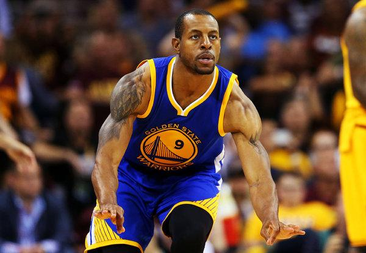
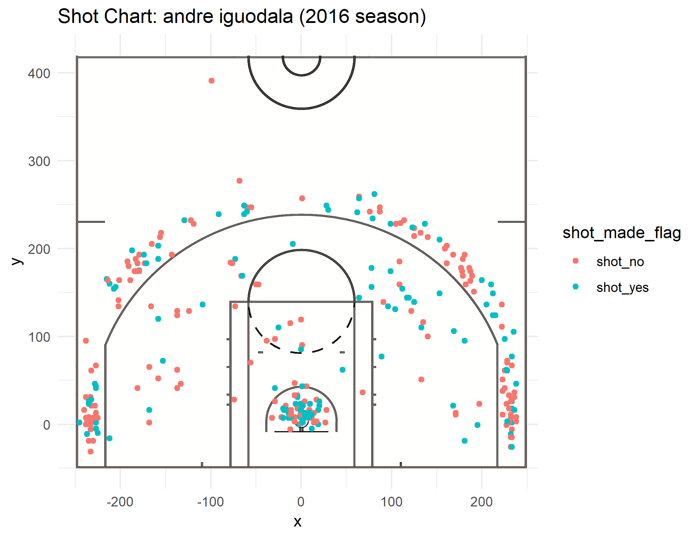
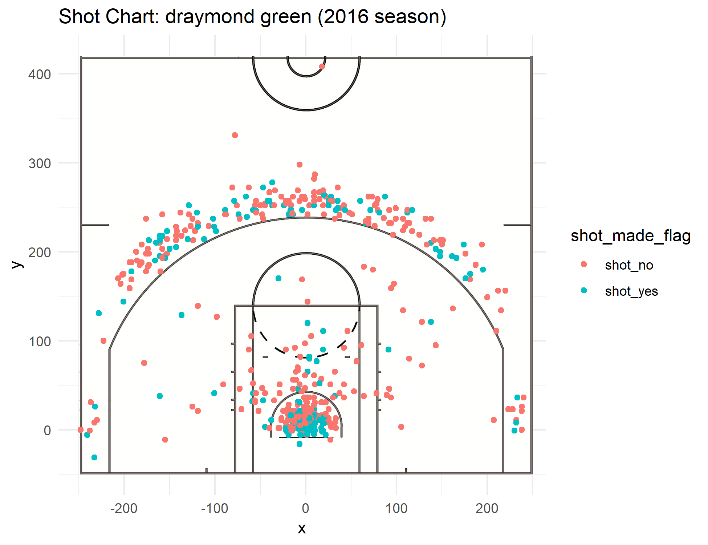
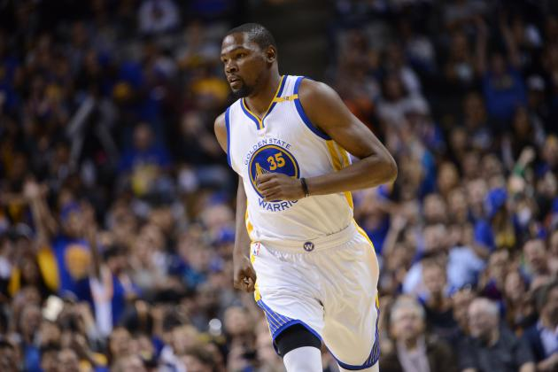
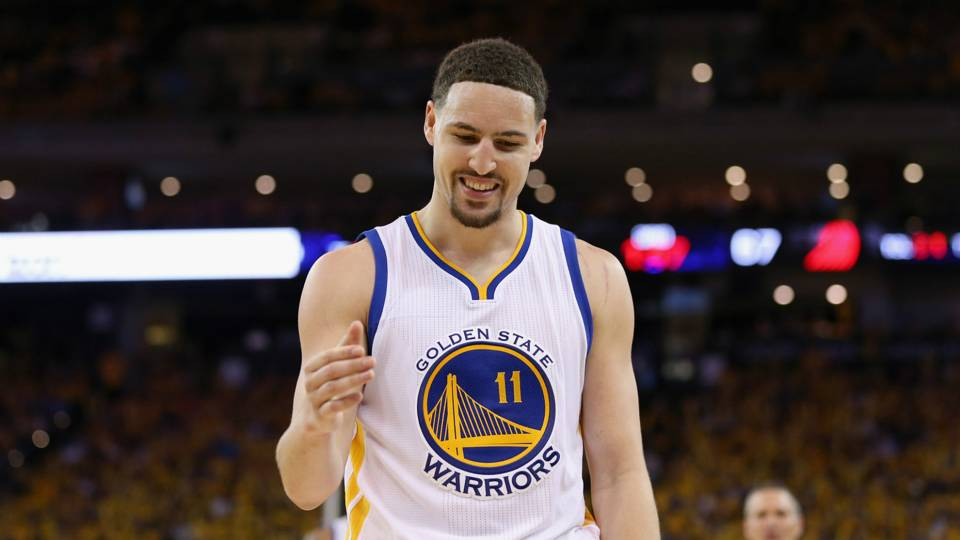
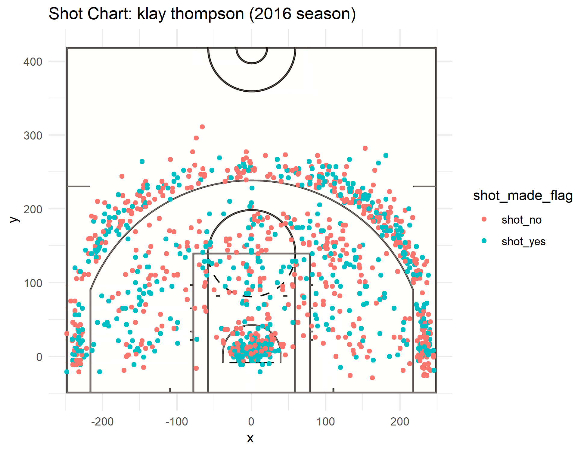
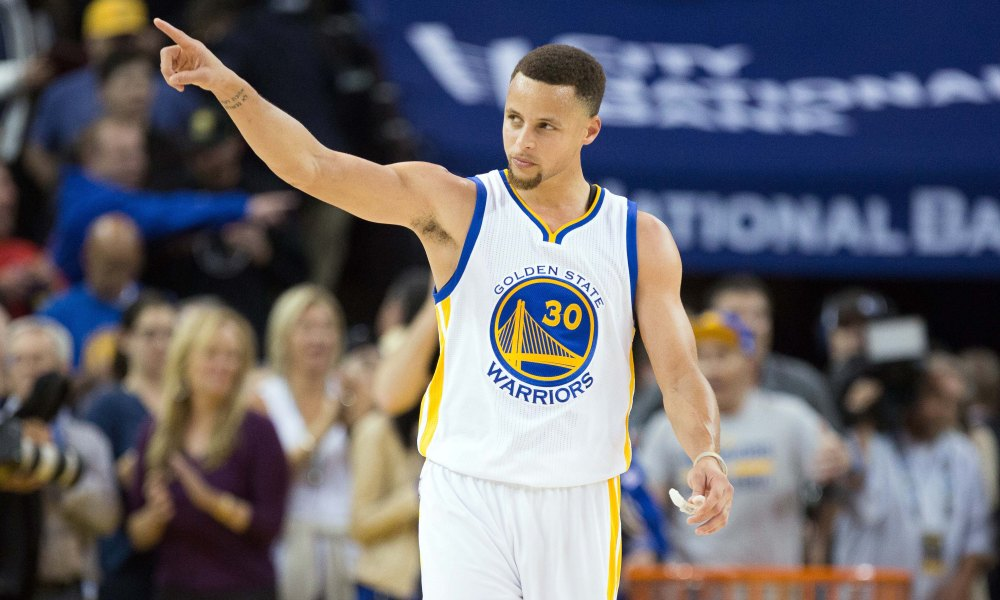
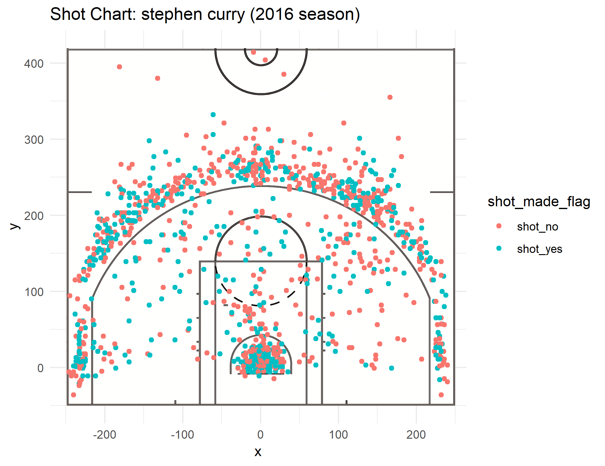

workout01-david-willigrod
================
David Willigrod
March 13, 2019

A Case for the 3: Statistical Analysis of the 2016 Warriors
===========================================================

Introduction
------------

In recent years, NBA teams have been scoring far more points. According to *Basketball Reference*, In the 2000 season, the average points per game was 94.8 while in the 2016 season (the season in which we will be doing our analysis), the average points per game was 105.6. What has been the cause of this astounding 11.4% increase in points per game? Although there are many factors that may have led to this offensive revolution, the increase in the amount of 3 point attempts is a large part to blame. In this report, I will use 5 members of the 2016 GSW roster to illustrate the effectiveness of the 3 ball as well as examine which locations on the court produce the most success.

Motivation and Background for This Case Study
---------------------------------------------

The Warriors have been at the forefront of this 3 point shooting revolution with players like Stephen Curry (shown below) 

leading the way. In the 2016 season, Stephen Curry shot 22% more 3 pointers than 2 pointers. This would have been unthinkable more than a decade ago. The Golden State Warriors also exemplify one of the biggest increases in points per game since the 2000 season. According to *Basketball Reference* back then they averaged just 92.5 points per game; however, in the 2016 season, they averaged 115.9 points per game. That is an increase in 25%! We will be looking at five Golden State Warriors in particular who have embraced the three ball with at lease 160 attempts in the season: Andre Iguodala, Draymond Green, Kevin Durant, Klay Thompson, and Stephen Curry. We will be looking at these players as they have a good mix of two pointers and three pointers allowing us to have a more in depth analysis of the relative effectiveness of each.

Data
----

In order to collect the data, I imported the data of every shot taken by each of these five players. I then produced shot charts differentiating between the made and missed shots using x and y coordinated of the basketball court:  I then produced summary statistics of each of the players and the five players as a whole to gain insights into the distribution of the distance of their shots.
After that, I produced a table of the players, 2 pointer and 3 pointer made shots, total shots, percentage made, and effective percentage made.
Effective percentage made is a useful statistic as it allows one to compare 2 pointers to 3 pointers more effectively. This is because the reward of a 3 pointer is 3 points while the reward of a 2 pointer is only 2 points. This means that if a player is shooting 40% from 3 pointers, each shot is expected to get 1.2 points; however, if a player is shooting 40% from 2 pointers, each shot is only expected to get 0.8 points. In order for the 2 point shot to be as effective as the 3 point shot, the player needs to have a 1.5x higher field goal percentage from 3 point attempts than 2 point attempts. So in the previous example, the shooter would need to shoot 1.5 \* 40% = 60% from 2 pointers in order to be as effective as the 40% from 3 pointers. Therefore in order to compare the effectiveness of each shot, we must multiply the shooting percentage of 3 pointers by 1.5x to produce effective shooting percentages. Here are the following 2 point shot and 3 point shot tables respectively:

    # A tibble: 5 x 5
      name           total  made perc_made eperc_made
      <chr>          <int> <int>     <dbl>      <dbl>
    1 Andre Iguodala   210   134     0.638      0.638
    2 Draymond Green   346   171     0.494      0.494
    3 Kevin Durant     643   390     0.607      0.607
    4 Klay Thompson    640   329     0.514      0.514
    5 Stephen Curry    563   304     0.540      0.540

    # A tibble: 5 x 5
      name           total  made perc_made eperc_made
      <chr>          <int> <int>     <dbl>      <dbl>
    1 Andre Iguodala   161    58     0.360      0.540
    2 Draymond Green   232    74     0.319      0.478
    3 Kevin Durant     272   105     0.386      0.579
    4 Klay Thompson    580   246     0.424      0.636
    5 Stephen Curry    687   280     0.408      0.611

I then created a table that looked at all the shots each player took that included the effective shooting percentage of each player. I did this by multiplying the 2 point percentage made by the the percentage of 2 pointers they shot vs. total shots they took and added that to the 3 point **effective percentage made** multiplied by the percentage of 3 pointer they shot vs. total shots they took. This produced the following table:

    # A tibble: 5 x 5
      name           total_shots  made perc_made eperc_made
      <chr>                <int> <int>     <dbl>      <dbl>
    1 Andre Iguodala         371   192     0.518      0.596
    2 Draymond Green         578   245     0.424      0.488
    3 Kevin Durant           915   495     0.541      0.598
    4 Klay Thompson         1220   575     0.471      0.572
    5 Stephen Curry         1250   584     0.467      0.579

Analysis
--------

Let's start our analysis by looking at each of the five players indidually, especially looking at their effective shooting percentages of 2 pointers vs. 3 pointers.

### Andre Iguodala

Andre Iguodala was a core bench player during the Warriors 2016 season. He shot appoximately 43% of his shots from behind the arc with a effective shooting percentage of 54.0%. From 2 pointers, his effective shooting percentage was 63.8%. This would go against my original hypothesis; however, if we look back at his shot chart: 
We see that a large proportion of his shots are close to the rim. Andre Iguodala shot the fewest shots of the five players that we are examining with only 371 shot attempts and a good percentage of them are up close. This leads me to believe that for low volume shooters, their effective shooting percentage will be greater from 2 pointers as they are less willing to shoot shots that aren't high percentage shots close to the rim.

### Draymond Green

Draymond Green started for the Warriors and is known as a defensive powerhouse. His offensive stats, however, are the most underwhelming of the 5 players that we are examining. He is also known to be a poor 3 point shooter Draymond shot approximately 40% of his shots from behind the arc with an effective shooting percentage of 47.8%. He had a marginally better 2 point effective shooting percentage of 49.4%. Similarly to Andre Iguodala, Draymond is a relatively low volume shooter, putting up only 578 shots on the year.In addition, he is the least effective with his shots. Looking at his shot chart

we see that even moreso than Andre Iguodala, he shoots a great pecentage of his shots close to the rim. He has very few long 2 point shots boosting his effective shooting percentage of 2 pointers. Even with this fact, as well as the fact that he only shoots 31.9% from 3 pointers, his effective shooting percentage from behind the arc is only 1.6% behind that of his 2 pointers. This leads me to believe that when given the option of a 3 pointer or a shot from more than 10 feet out, he is much more effective from behind the arc.

### Kevin Durant

Kevin Durant came to the Warriors in the 2016 season and immediately had a large impact. He shot only approximately 30% of his shots from behind the arc with an effective shooting percentage of 57.9%. Kevin Durant also had a fairly higher effective shooting percentage from 2 pointers of 60.7%; however, this is again under a 3% difference. looking at his shot chart:

we see a large percentage of his are from close to the rim; however, he does shoot a great deal from mid range. If you begin to examine what percentage of his shots that he makes from mid range vs. from 3 pointers, it appears to be similar. Since not every possession will be able to yield a shot right at the rim, this lends itself to my hypothesis that shooting from behind the arc leads to more points.

### Klay Thompson

Next we move on to a 3 point specialist: Klay Thompson. Klay is a high volume shooter who is known for his knock down 3. Klay shoots approximately 48% of his shots from behind the arc with an impressive 63.6% effective shooting percentage. This more than 12% higher than his effective 2 point field goal percentage of 51.4%. Looking at his shot chart: 
we see that he shoots a tremendous amount from behind the arc. Similar to Kevin Durant, Klay shoots a fair amount of mid-range shot and he appears to make a similar percentage from 3 pointers. Klay shoots over 250 more shots per game than Andre Iduodala and Draymond Green combined making his relative effective percentages fair more relavant in my analysis. Since his margin between his 3 point effective shooting percnentage and his 2 point effective shooting percentage is the greatest absolute margin out of the five players, Klay exemplifies the incredible power of the 3 ball.

### Stephen Curry

Finally let's take a look at Stephen Curry. He was the highest volume shooter for Warriors in 2016 putting up 1250 shots. As mentioned earlier, Curry shot more 3 pointers than 2 pointers with approximately 55% of his shots coming from behind the arc. From 3 pointers he had an impressive 61.1% effective shooting percentage. From 2 pointers, he only had a 54.0% shooting percentage making the margin between his 3 point effective shooting percentage and his 2 point effective shooting percentage over 7%. Looking at his shot chart: 
a few things stick out. First is how many shots close to the rim he took. Despite this fact, his effective shooting percentage is still over 7% higher from 3 pointers illustrating the incredible power of the 3 ball. On top of this, we see many shots from well behind the 3 that were probably taken the end of the quarter (17 more shots were taken outside the range of the shot chart). These are very low percentage shots and bring down his 3 point shooting percentage. Given these two facts, the 7% increased effective percentage of shots from 3 pointers over 2 pointers understates the value of the 3 ball for Stephen Curry.

### The Golden State Warriors as a Whole

    # A tibble: 1 x 4
      total_shots  made perc_made eperc_made
            <int> <int>     <dbl>      <dbl>
    1        4334  2091     0.482      0.570

Looking at the team as a whole, we see that the Warriors had an impressive 57% effective field goal percentage. When comparing that to their most high volume shooters: Klay Thompson and Stephen Curry, we see that is over 4% below Stephen Curry's effective 3 point percentage and over 6% below Klay Thompson's effective 3 point percentage. Looking at the five players' shot charts side-by-side:

we see the sheer volume that Klay Thompson and Stephen Curry shot relative to the other 3 players. We also see the concentration of shots by the rim, with a higher proportion of shots at the rim for the lower volume shooters. This leads me to believe that the 3 pointer is an incredibly effective tool for a majority of shots unless a shot close to the rim makes itself available.

Discussion
----------

So far in this report, I've produced evidence that the increase in the volume of 3 pointers has led to an increase in the amount of points scored in NBA games. I want to also go over scenarios where this may not be the case as well as other factors that may be at play in this offensive revolution.
For teams that only have players that struggle from 3 such as Draymond Green who shoots an abyssmal 31.9% from behind the arc, it will be more effective for them to stick to their strengths, attack the basket, and attempt to get higher percentage 2 point attempts. This is shown by Draymond Green's shot chart displayed earlier which had a great percentage of his shots in the key.
Another factor that wasn't discussed in this report is the increase in pace of the NBA. Teams have begun to move the ball faster up court and put up a shot faster. This leads to more possessions per game and shots per game. So along with the effective field goal percentages rising as teams shoot more 3s, so too have the total shots per game. Total shot attempts per game was 80.6 in the 2000 season and has risen by almost 6% to 85.4 shot attempts per game. One has to also consider that with taking less time to put up a shot, there may be lower quality shots attempted on average.

Conclusion
----------

The increase in the number of 3 point attempts from high volume shooters, such as Stephen Curry and Klay Thompson, has led to a rapid increase in the amount of points per game. My analysis of five Golden State Warriors players has shown that the 2 players that put up the most shots (far more than the other 3 combined) have much higher effective shooting percentages from 3 pointers than from 2 pointers. This means that the points per shot from 3 pointers were much higher than the points per shot from 2 pointers for Klay Thompson and Stephen Curry. I also differentiated between shots close to the rim and mid range 2 pointers. If a player is able to get a high percentage shot close to the rim, then he should obviously take it. For mid range shots; however, we saw by examing the shot charts that the effective field goal percentages were much higher from 3 pointers since they made close to the same percentage of shots from both.
For lower volume scorers, a greater percentage of their shots are closer to the rim. This makes sense as they would be more likely to pass up decent shot in order to give it to a player that has a higher effective shooting percentage. This increases their effective shooting percentage of 2 pointers as a higher percentage of them are closer to the rim. This is why the effective shooting percentage of the lower volume scorers is higher from the 2 point attempts than 3 point attempts. Since these players don't have nearly as many field goal attempts, this fact becomes less relevant in my analysis. In conclusion, the increase of the number of 3 pointers as well as their effectiveness as demonstrated by these 5 Warriors players has led to a rapid increase in the number of points scored per game.

References
----------

1.  *Basketball Reference*, <https://www.basketball-reference.com/leagues/NBA_stats_per_game.html>
2.  *Github repository*, <https://github.com/ucb-stat133/stat133-hws/tree/master/data>
3.  Dan Kopf. "Data analytics have made the NBA unrecognizable", *Quartz*, <https://qz.com/1104922/data-analytics-have-revolutionized-the-nba/>
